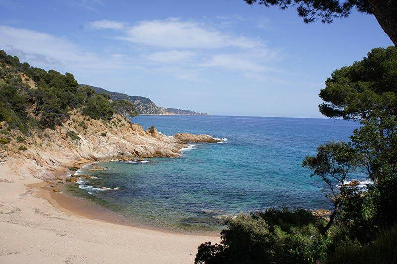

(about_me)=
# About me

I'm a physicist/engineer converted into a computational statistician.
I love statistical data analysis, programming and data visualization.
I am a core contributor of both {doc}`ArviZ <arviz_org:index>` a project for exploratory
analysis of Bayesian models and {doc}`PyMC <pymc_io:index>` a Python library for probabilistic programming.
In addition to probabilistic modelling, I also enjoy teaching and technical writing.

I think that the culture in scientific research needs deep changes towards a
more collaborative, open and diverse model. I am interested in open science,
reproducible research and science communication. I want to pursue a career in
probabilistic modelling and statistical research with special emphasis on
openness and reproducibility.

In my spare time, I like playing board games and going to the beach to do
water activities. I have been sailing and snorkeling regularly since I was
little and more recently I added kayaking to the mix too! I generally spend
the summer at the _Costa Brava_. Here I leave you a sneak peak of the views
when nobody is around.

(talks_conferences)=
## Talks and conferences
::::{dropdown} Google Summer of Code (GSOC) Experience
:icon: device-camera-video

Panel discussion organized by [Data Umbrella](https://www.dataumbrella.org/)
about our experiences participating in [GSoC](https://summerofcode.withgoogle.com/)

:::{youtube} YE-TYJmvbfg
:::

::::
::::{dropdown} Contributing to ArviZ and Open Source: Social and technical sides
:icon: device-camera-video
:open:

Online webinar with [Data Umbrella](https://www.dataumbrella.org/).

:::{youtube} 457ZTes4xOI
:::

**Webinar resources**
* Slides: https://oriolabril.github.io/contributing_to_arviz/
  ({kbd}`space` for next slide)
* Example PR: https://github.com/arviz-devs/arviz/pull/2176
* Source repo: https://github.com/OriolAbril/contributing_to_arviz

::::
::::{dropdown} Contributing to PyMC documentation
:icon: device-camera-video

Online webinar with [Data Umbrella](https://www.dataumbrella.org/).

:::{youtube} fzpmLWQNj4A
:::

**Webinar resources**
* Presentation material: https://pymc-data-umbrella.xyz/en/latest/about/contributing_to_documentation/docs_presentation.html
* PyMC Series paylist: https://www.youtube.com/playlist?list=PLBKcU7Ik-ir99uTvN0315hIVLuyj4Q1Gt
* Sprint website: https://pymc-data-umbrella.xyz/en/latest/2022-07_sprint/schedule.html
::::
::::{dropdown} Intuitive Bayesian Modeling and Computation with PyMC
:icon: device-camera-video

Online webinar with [Data Umbrella](https://www.dataumbrella.org/).

:::{youtube} 6dc7JgR8eI0
:::

**Webinar resources**
* Slides: https://oriolabril.github.io/pymc3-data_umbrella/
  ({kbd}`space` for next slide)
* PyMC Series paylist: https://www.youtube.com/playlist?list=PLBKcU7Ik-ir99uTvN0315hIVLuyj4Q1Gt
::::
:::{dropdown} Backend agnostic Exploratory Analysis of Bayesian Models

Poster presentation at [PROBPROG](https://probprog.cc/) 2020.

**Resources**
* Poster pdf: https://raw.githubusercontent.com/OriolAbril/arviz-probprog-2020/main/probprog_poster.pdf
* Source and code examples: https://github.com/OriolAbril/arviz-probprog-2020
:::

::::{dropdown} ArviZ, InferenceData and netCDF: A unified file format for Bayesians
:icon: device-camera-video

Collaborative talk at StanCon 2020.

:::{youtube} TOCphac1GM0
:::

**Resources**
* Slides and video presentation are available at [GitHub](https://github.com/arviz-devs/arviz_misc/tree/master/stancon_2020),
  the slides are executable thanks to Binder!
  - Slides and video presentations are available in English, Catalan, French and Finnish.
::::

## Industry related work

I am currently working with the [PyMC Labs](https://www.pymc-labs.com/) consultancy
and the [IntuitiveBayes](https://www.intuitivebayes.com/) online courses.

Moreover, in the past I have been grant funded to maintain and develop ArviZ 
from [CZI EOSS](https://chanzuckerberg.com/eoss/) and [NumFOCUS small development](https://numfocus.org/programs/small-development-grants) grants.

## Academic work and publications
I have also worked as doctoral researcher and research assistant,
at Helsinki University and at Universitat Pompeu Fabra respectively.
Here are some publications I have helped a bit with:

* Abril-Pla, Oriol, et al. "PyMC: a modern, and comprehensive probabilistic programming framework in Python." _PeerJ Computer Science 9_ (2023): e1516. [https://doi.org/10.7717/peerj-cs.1516](https://doi.org/10.7717/peerj-cs.1516)
* Mikkola, Petrus, et al. "Prior knowledge elicitation: The past, present, and future." _Bayesian Analysis_ 19.4 (2024): 1129-1161. [https://doi.org/10.1214/23-BA1381](https://doi.org/10.1214/23-BA1381)
* Icazatti, Alejandro, et al. "PreliZ: A tool-box for prior elicitation." _Journal of Open Source Software_ 8.89 (2023): 5499. [https://doi.org/10.21105/joss.05499](https://doi.org/10.21105/joss.05499)
* Rossell, David, Oriol Abril, and Anirban Bhattacharya. "Approximate Laplace approximations for scalable model selection"
  _Journal of the Royal Statistical Society: Series B (Statistical Methodology)_ 83.4 (2021): 853-879. [https://doi.org/10.1111/rssb.12466](https://doi.org/10.1111/rssb.12466)
* Badenas-Agusti, Mariona, et al. "HD 191939: Three Sub-Neptunes Transiting a Sun-like Star Only 54 pc Away."
  _The Astronomical Journal_ 160.3 (2020): 113. [https://doi.org/10.3847/1538-3881/aba0b5](https://doi.org/10.3847/1538-3881/aba0b5)
* Foreman-Mackey, Daniel, et al. "emcee v3: A Python ensemble sampling toolkit for affine-invariant MCMC."
  _Journal of Open Source Software_ 4.43 (2019): 1864. [https://doi.org/10.21105/joss.01864](https://doi.org/10.21105/joss.01864)

(support_me)=
## Support me
You can support me directly via

:::{include} partials/donations.md
:::

When you support me directly you are both
helping me dedicate time to the open source projects I contribute to
and sustaining this blog and other personal projects.

If you or your company prefers supporting the open source projects directly,
you can also do so through NumFOCUS:

:::::{grid} 2
::::{grid-item}
:class: sd-text-center

:::{button-link} https://numfocus.org/donate-to-arviz
:color: primary

Donate to ArviZ
:::
::::
::::{grid-item}
:class: sd-text-center

:::{button-link} https://numfocus.org/donate-to-pymc
:color: primary

Donate to PyMC
:::
::::
:::::

When donating to ArviZ or PyMC, you are supporting me indirectly,
along with the rest of the people who make these libraries possible.

If you or your company use open source and have the means to do so, please consider donating somehow.
We need some financial support to make sure open source is sustainable.

